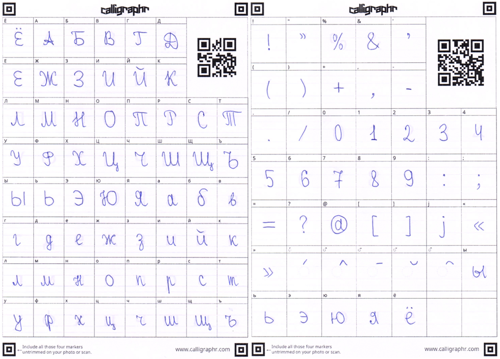
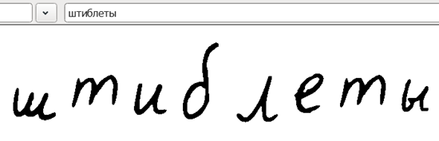
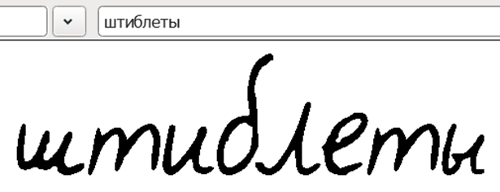

# FontForge scripts

Handwritten fonts from Calligraphr require processing to be considered usable. The diacritics and base glyphs don't have anchors, vertical alignment and kerning is all over the place.

Scripts in order:

- `create_base_font.py`: prompts for two ttf files for two different forms and combines them. Let's say that we try to get everything from the free version.

	

- `preprocess_font.py`: do glyph autowidth, set apostrophe's and diacritic's width to 0 and space's width to 300
- `add_anchors.py`: adds anchors to diacritics and base glyphs base on their shape
- `kern_font.py`: autokern pairs of big and small letters

# Usage

There is a way to run fontforge from terminal and from python but I'm using Windows so I just copypasted the scripts into "Run Script" window. It can be accessed from "File" or with Ctrl+. hotkey.

# Before and after

	  
	

